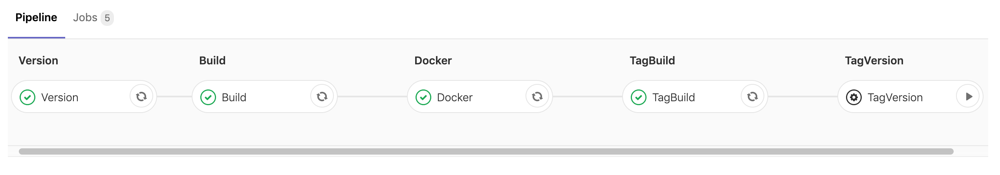

Release process 📦
==================================

Our backend has a micro-service architecture. 
To help improve the release process we are using [Semantic Release](https://semantic-release.gitbook.io/semantic-release/) in our commits.

To automate finding the next version, we use [go-semrel-gitlab](https://juhani.gitlab.io/go-semrel-gitlab/) in our pipelines.

## Merge requests

Every merge request should run a pipeline to build, test and lint those changes, and only when everything is ✅ the merge can be done. 

The stages for the merge requests are:

- `BuildMR` - Build or assemble the project
- `LintMR` - Run lint checks
- `TestsMR` - Run tests 

## After merge

After the merge is merged (🤯), a new set of jobs should run, to effectively release the new build.

The stages are: 

- `Version` - Find the new version for the build. As we do not deploy automatically to **production**, we use a build number for the releases. Usually we use [GitHub flow](https://guides.github.com/introduction/flow/), so the build number could be the number of commits in the `master` branch.

- `Build` - Build the project and produce the binary (.jar, .exe 🤢, if applied ), should the defined as an artifact.

- `Docker` - Create the docker image and upload it to the GitLab Registry, to the `builds` folder and tagged with the version defined in the `Version` job.

- `TagBuild` - Create a tag, with the format `builds/[number]`, and push it to the remote. Also, this will trigger a new pipeline that will deploy this to `development` environment

- `TagVersion` - Tags a version, based on `Semantic Release`, this will trigger a new pipeline that will deploy this build to `production` environment

#TODO
- DeployDevelopment
- DeployProduction

